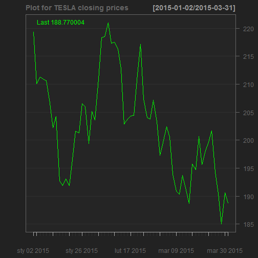

## Purpose of application

Purpose of the application and value delivered to users by Stock Analyzer:
- facilitates analysis of financial data by visualization and summarizing stock price time series
- wide choice of up-to-date financial data for analyzis thanks to sourcing data from yahoo
- automatically fits best ARIMA model to chosen data
- provides forecast based on fitted model along with visualization of such forecasts
- possibility of choosing forecast period (between 1 and 10 observations, however, in my view, ARIMA models are useful rather for purpose of short term forecasts)

---
## Back-end - downloading data

Stock Analyzer uses quantmod library which provides many useful tools for sourcing and analyzing data.

Below code downloads financial data for TESLA (manufacturer of my favourite cars) for the indicated period.

```r
suppressWarnings(library(quantmod))
data<-suppressWarnings(getSymbols(Symbols="TSLA",src="yahoo",auto.assign=FALSE,
from = "2015-01-01",to = "2015-3-31"))
data<-data[,4] #get only closing prices
```

---
## Back - end - plotting data
Quantmod package is also used for visualizaing data which is done with the following code.

```r
chartSeries(data,ctype="line",name = "Plot for TESLA closing prices")
```



---
## Back - end - fitting model

After visualizing model we use forecast library (which is great for dealing with time series data) to fit best ARIMA model. In short auto.arima function which is used fits best ARIMA model based on information criteria (in our case AIC criterion). The functions goes through different values of parameters (p,d,q) and chooses best model. Following code performs model fitting.  


```r
suppressWarnings(library(forecast))
fit<-auto.arima(data,ic="aic",stepwise=TRUE,trace=FALSE)
```
Thank you very much for your attention and enjoy using Stock Analyzer!
